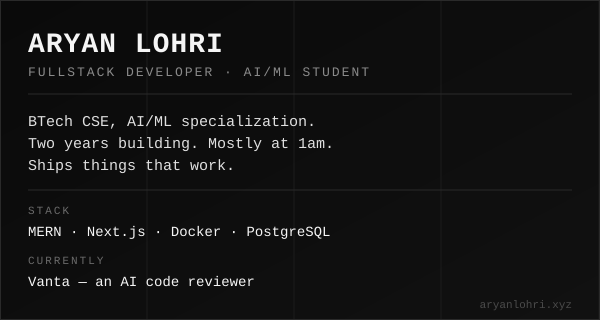

 

<table>
<tr>
<td width="100%">

</td>
</tr>
</table>

 

  

### Building

| Project | What it is | Stack |
|---|---|---|
| **Vanta** | AI code reviewer | Next.js · Express · Docker · PostgreSQL · Redis · BullMQ · Socket.IO |
| **Void** | Browser-based JS debugger | React · Vite · Acorn · WebAssembly |
| **PreventX** | Healthcare ML tool | Python · FastAPI |
| **ClearLit** | Browser extension | Manifest V3 |
| **AudioScribe** | Speech recognition | Python · NLP |

 

BTech CSE, AI/ML specialization, Vellore Institute of Technology, Bhopal. Two years of hands-on development, mostly MERN and Next.js. Currently open to internships and freelance work.

