<!-- hero: two separate terminal-window panels — portrait (top-to-bottom
     reveal) and wordmark (wipe + rock). Each SVG bakes in its own
     title-bar chrome since GitHub strips custom CSS from README HTML.
     portrait: python scripts/generate_mark.py
     wordmark: static file, wordmark.svg -->

<table>
<tr>
<td valign="top"></td>
<td valign="top"></td>
</tr>
</table>

 

<!-- animated contribution graph: real data, diagonal cell-by-cell reveal
     (regenerated daily by .github/workflows/update-readme.yml) -->

### `aryan@github ~ $ ./contributions.sh`

  

### `aryan@github ~ $ ./links.sh`

 

### Building

| Project | What it is | Stack |
|---|---|---|
| **Vanta** | AI code reviewer | Next.js · Express · Docker · PostgreSQL · Redis · BullMQ · Socket.IO |
| **Void** | Browser-based JS debugger | React · Vite · Acorn · WebAssembly |
| **PreventX** | Healthcare ML tool | Python · FastAPI |
| **ClearLit** | Browser extension | Manifest V3 |
| **AudioScribe** | Speech recognition | Python · NLP |

 

BTech CSE, AI/ML specialization, Vellore Institute of Technology, Bhopal. Two years of hands-on development, mostly MERN and Next.js. Currently open to internships and freelance work.

